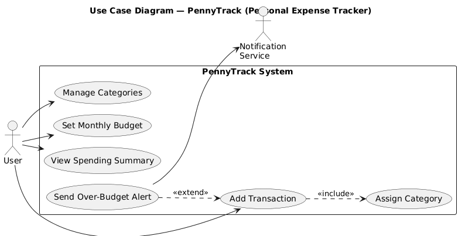
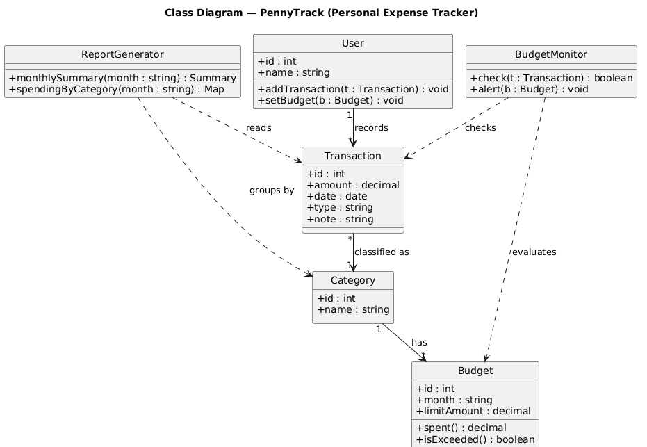

# PennyTrack: Requirements, Modeling, and Initial Sprint Plan

**Author:** Ahmad Hamza  
**Affiliation:** Study.com  
**Course:** Software Engineering  
**Date:** June 26, 2026

---

## 1. Project Description

PennyTrack is a simple personal expense-tracking application that helps individuals record what they spend, organize it into categories, and see where their money goes each month. A user logs expenses and income, assigns each entry to a category, and sets monthly budgets; the app then summarizes spending and warns when a category goes over budget. It is aimed at everyday people who want a lightweight way to understand their finances without the complexity of full accounting software. The first version targets a single user on one device, with data stored locally.

## 2. Functional and Non-Functional Requirements

### 2.1 Functional Requirements

**FR1 — Record a transaction:** The system shall let the user add an expense or income entry with an amount, date, category, and optional note.

*Rationale.* Recording transactions is the foundation of the whole product; without it none of the budgeting or reporting features have data to work with. The main stakeholder, an everyday user, needs entry to be quick and forgiving so it actually gets done in the moment of spending. Supporting both expenses and income, with a note for context, reflects the early insight that people abandon trackers that feel like data entry. Keeping the required fields minimal — amount, date, and category — balances useful detail against the constraint of low effort per entry.

**FR2 — Manage categories:** The system shall let the user create, rename, and delete spending categories and assign each transaction to one.

*Rationale.* Categories are how users make sense of their spending, and everyone organizes money differently, so the system cannot rely on a fixed built-in list. Letting users manage their own categories addresses the stakeholder need to mirror how they actually think — for example separating groceries from dining out. This requirement also enables the reporting and budget features, which group data by category. The constraint is that deleting a category in use must be handled gracefully so existing transactions are not orphaned or silently lost.

**FR3 — Set and track monthly budgets:** The system shall let the user set a monthly spending limit per category and show progress toward that limit.

*Rationale.* Tracking alone tells users what happened; budgets let them plan and change behavior, which is the real value most users want. The requirement comes directly from the stakeholder goal of controlling spending rather than just observing it. Showing live progress against each limit gives feedback while there is still time to act. A constraint discovered early is that budgets are inherently monthly and per category, so the data model must tie a limit to both a category and a specific month rather than a single global number.

**FR4 — View spending summary:** The system shall display a monthly summary of spending by category, including totals and a simple chart.

*Rationale.* A summary turns dozens of individual entries into an at-a-glance picture, which is what lets a user actually understand where their money goes. Stakeholders said raw lists of transactions were overwhelming and hard to learn from. Grouping spending by category for a chosen month, with totals and a basic chart, directly serves the goal of insight. The constraint is that the summary must compute quickly from stored transactions on a typical phone or laptop, so the aggregation has to stay simple and efficient.

### 2.2 Non-Functional Requirements

**NFR1 — Usability:** Adding a transaction shall take only a few taps, and the main screens shall be understandable without training.

*Rationale.* Because the target users are ordinary people, not accountants, the app only delivers value if it is genuinely easy to use; friction directly reduces how consistently people log expenses. The expectation, set from observing why people drop budgeting apps, is that a new expense can be added in just a few taps and that screens are self-explanatory. This shapes design choices such as smart defaults for date and category. The constraint is that simplicity must not hide the core actions of adding, categorizing, and reviewing spending.

**NFR2 — Security and privacy:** The system shall keep financial data on the user’s device and protect access to the app.

*Rationale.* Spending data is sensitive, so a central stakeholder concern is that personal financial information stays private and is not exposed. Storing data locally on the device, rather than in a shared cloud, both satisfies this privacy expectation and keeps the first version simple and cheap to run. Protecting access — for example with a device lock or app passcode — guards against casual snooping if the device is shared. The constraint is that security measures must not add so much friction that they undermine the usability goal.

**NFR3 — Performance:** Entries shall save instantly and monthly summaries shall load within about a second on a typical device.

*Rationale.* Users add expenses in short, in-the-moment bursts, so any lag while saving or viewing totals makes the app feel broken and discourages use. The expectation is that saving an entry feels immediate and that a monthly summary loads in roughly a second. This influences the choice of an efficient local data store and pre-computed or indexed aggregates rather than recalculating everything from scratch. The governing constraint is that this responsiveness must hold on an ordinary phone or laptop, not just high-end hardware.

## 3. UML Diagrams

### 3.1 Use Case Diagram

*Figure 1. Use case diagram.*

### 3.2 Class Diagram

*Figure 2. Class diagram.*

## 4. Product Backlog

**US1.** As a user, I want to add an expense with an amount, date, and category, so that I can keep a record of my spending.

*Acceptance criteria:*

- The add form accepts amount, date, category, and an optional note.
- Saving adds the transaction to the current month’s list.
- Amount must be a positive number or the entry is rejected with a clear message.

**US2.** As a user, I want to create and edit categories, so that I can organize transactions the way I think about my money.

*Acceptance criteria:*

- The user can add, rename, and delete categories.
- New transactions can be assigned to any existing category.
- Deleting a category in use prompts the user before proceeding.

**US3.** As a user, I want to set a monthly budget per category, so that I can control how much I spend in each area.

*Acceptance criteria:*

- A monthly limit can be set for each category.
- Progress toward the limit is shown as spending is recorded.
- Budgets are tracked separately for each month.

**US4.** As a user, I want to see a monthly summary of spending by category, so that I can understand where my money goes.

*Acceptance criteria:*

- The summary shows total spending per category for a selected month.
- A simple chart visualizes the category breakdown.
- The user can switch between months.

**US5.** As a user, I want an alert when I exceed a category’s budget, so that I can adjust before overspending further.

*Acceptance criteria:*

- When a new transaction pushes a category over its limit, an alert is shown.
- The alert names the category and the amount over budget.
- Alerts only trigger for categories that have a budget set.

**US6.** As a user, I want my data stored on my device, so that my financial information stays private.

*Acceptance criteria:*

- All transactions, categories, and budgets are saved locally.
- No account or internet connection is required to use the app.
- The app can optionally be locked behind a passcode.

## 5. Sprint Planning

Initial one-week sprint delivering the minimum usable core (US1, US2, US4).

| Story | Task | Effort | Timeline | Tools / Resources |
|---|---|---|---|---|
| US1 Add transaction | Design the local data model and storage layer | 4 h (2 pts) | Day 1 | SQLite / local DB |
| US1 Add transaction | Build the add-transaction form (amount, date, category, note) | 5 h (3 pts) | Day 1–2 | UI framework (e.g., React Native) |
| US1 Add transaction | Validate input and persist the entry | 3 h (2 pts) | Day 2 | App code, unit tests |
| US2 Manage categories | Build category add / rename / delete UI | 4 h (2 pts) | Day 3 | UI framework |
| US2 Manage categories | Persist categories and link them to transactions | 2 h (1 pt) | Day 3 | SQLite / local DB |
| US4 Spending summary | Aggregate monthly spending by category | 4 h (2 pts) | Day 4 | App code, SQL queries |
| US4 Spending summary | Build the summary screen with totals and a chart | 5 h (3 pts) | Day 4–5 | Charting library |
| US4 Spending summary | Add month switching and test end-to-end | 3 h (2 pts) | Day 5 | Manual QA, test data |

### 5.1 SDLC Model and Justification

This sprint follows an Agile approach using Scrum practices on an iterative and incremental delivery model (Schwaber & Sutherland, 2020). The model fits a small application whose exact feature priorities are still being learned: the safest way to validate PennyTrack is to ship a thin but working slice — record an expense, organize it, and see a monthly summary — and then refine based on how it actually feels to use. Building in short, time-boxed sprints that each deliver a usable increment supports the Agile value of working software and responding to change over following a fixed plan (Beck et al., 2001). A sequential waterfall model would force every requirement to be finalized before any feedback, which is risky for a consumer-facing tool whose value depends heavily on day-to-day usability. Incremental delivery also lets lower-priority stories, such as over-budget alerts, move to a later sprint without blocking the core.

## 6. Reflection

Writing the requirements before any code made the project’s scope much clearer than starting from a feature wish list. Separating functional from non-functional requirements forced me to treat qualities like usability, privacy, and performance as first-class goals instead of afterthoughts, and writing a rationale for each one kept every feature tied to a real user need rather than something that merely seemed nice to build. Modeling was the most valuable step. The use case diagram made me see that the notification service is an external actor rather than part of my system, and the class diagram pushed me to give budget checking its own responsibility instead of burying it inside the transaction logic. At this early stage my main concerns are about quality and risk. Storing data only on the device protects privacy but creates a real danger of permanent data loss with no backup, the over-budget logic has tricky edge cases around partial months, and scope creep toward bank syncing could derail a simple tool. Identifying these issues now, on paper, is far cheaper than discovering them after release.

## References

- Beck, K., Beedle, M., van Bennekum, A., Cockburn, A., Cunningham, W., Fowler, M., … Thomas, D. (2001). Manifesto for agile software development. https://agilemanifesto.org/
- Larman, C. (2004). Applying UML and patterns: An introduction to object-oriented analysis and design and iterative development (3rd ed.). Prentice Hall.
- Schwaber, K., & Sutherland, J. (2020). The Scrum Guide: The definitive guide to Scrum: The rules of the game. https://scrumguides.org/
- Sommerville, I. (2016). Software engineering (10th ed.). Pearson.
